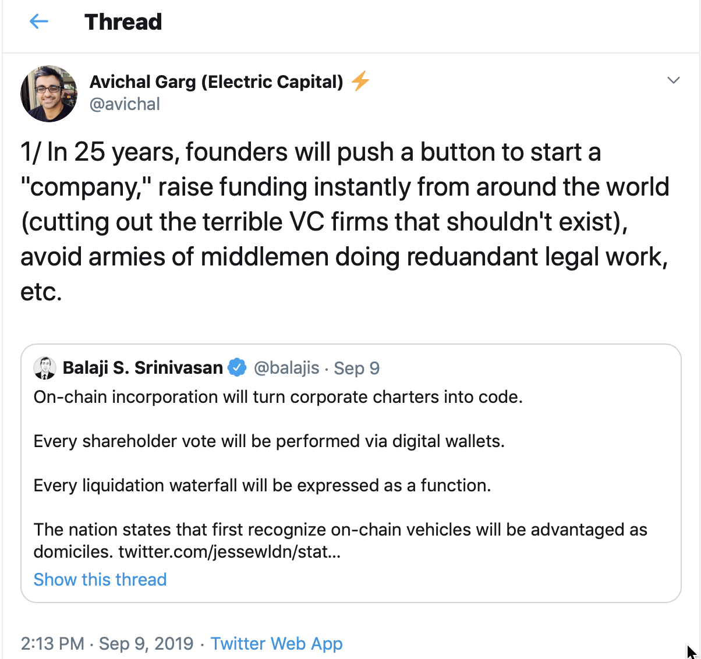
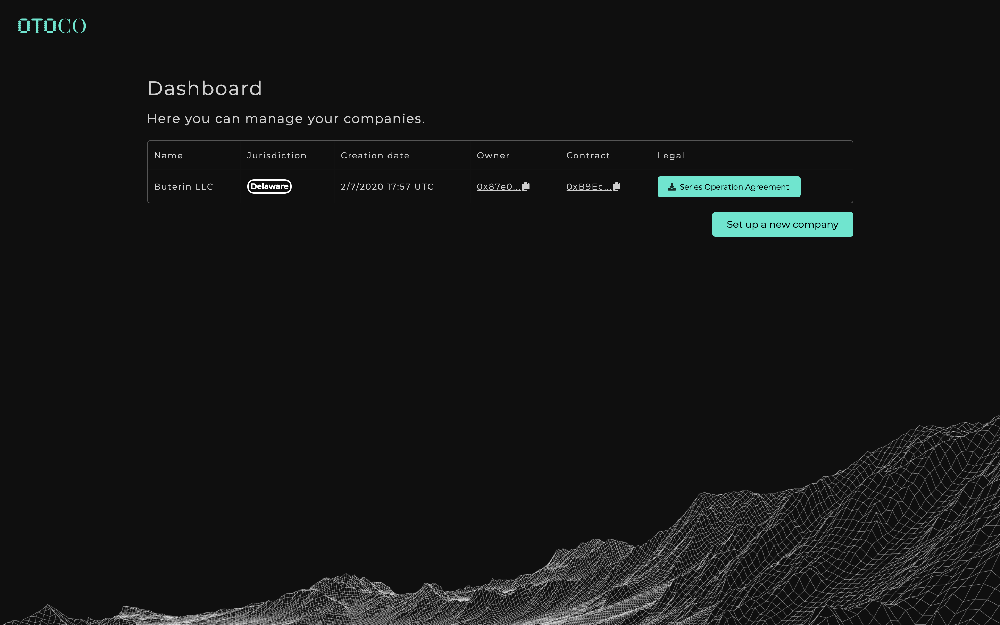

# Introducing OtoCo: A Blockchain-Native, Real-World LLC in Delaware, Instant and for only 39 DAI

## **A challenge thrown by the community of entrepreneurs and investors**

We started to work on our OtoCo product with 2 goals in mind:

1. We wanted to compress the time and cost of forming a new legal entity;   
2. whilst maintaining legal validity.

The demand for a "company at the push of a button" is heard quite often in entrepreneurial circles. Here are some recent calls:

## **Why does it not yet exist?**

We believe there are two main reasons:

**1. Inertia**

Companies formation is still largely done by lawyers and accountants. Their rituals go back to a time when companies were set up for a privileged class in society that could afford to surround itself with advisors and experts.

Resistance by middlemen combined with a reluctance to move away from the way things have always been done often conspire against the adoption of new technologies. It is not so long ago that we booked our flights through a travel agent, whilst now we all buy tickets online and download our boarding passes on our smartphone.

Company formation will inevitably go the same way

**2. Legal validity**

Secondly, new technology brings old fears. Will a company formed entirely online, without legal intermediaries, still be legally valid?  Andf if it can be done so cheaply, can it be good?

These fears may be justified and deserve a closer look.

The source of all legal validity is self-evidently the law. In the realm of company formation, Governments have by law monopolised the issuance of new incorporation certificates - legal "birth certicfiates" for companies - to official Registries.

Some of these Registries may be privately run however typically they are part of Government. In the United States, each State has its Registry.

It is by filing with such Registry that a new company is validly constituted: the new entity will have gained separate legal status from its founders and - if so chosen - will benefit from limited liability.

Typically, not just everybody can file: in some countries, only licensed entities can do so. In other jurisdictions, most notably the UK, anybody who wishes to form a new company can file directy with the Government Registry, in paper form or online.

In summary, there's _due process_ in forming a new legal entity. Legal validity doesn't come from lawyer involvement - though lawyers like us to believe it does! - but from respecting due proces.

As long as new technology follows due process, it can disintermediate away the analog and anachronistic rituals administered by the legal profession.

The result will be a process that can be condensed in both speed and cost. Before we examine how, we need to have a summary understanding of how US LLCs are created.

## **How are LLCs born?**

Limited Liability Companies are widely used in the US as "pass through" vehicles for tax reasons: its revenue is taxed - or passed through - at the level of its Members and not at the Corporate level itself.

At the extremes, they're being used as single purpose vehicles, e.g. to hold a property or a trademark, or as the operating entity for large enterprises, and any purpose inbetween.

In Delaware, home of most US LLCs, a simple Certificate of Formation is filed with the Delaware State Registry with mention of the chosen name and the name of the first Member\(s\).

If the desired name is not taken, a new LLC will typically be formed on the same day or within a day of filing, without any verification whatsoever of the identity of the first Member.

## **How we condensed speed of formation to seconds instead of hours**

This lack of attestation of identity at the moment of formation of a US LLC helps enormously in condensing the process: most jurisdictions require upfront Know-Your-Customer and Anti-Money Laundering checks when forming a new company, either at the official Registry level or by licensed formation agents, making the whole process a stop-start event which is difficult to automate and optimise for speed.

By contrast, in the US such checks are effectively pushed out and performed in time when the need arises, e.g. when the LLC applies for a bank account. As with real birth, the company's birth certificate gets issued first, the passport follows later - and only if there's a need to travel!

Still, for every new LLC filed, there's a wait until Registry stamps its birth certificate. To bring our speed down to seconds, rather than hours, we had a closer look at a relatively new variant of the LLC, the Series LLCs.

A Series has a Master and individual Series. Each Series is considered an LLCs in its own right, with its own name and its own Member\(s\) independent from the Members of the Master LLC and other Series' Members.

Crucially, the assets and liabilities between the Series amongst themselves and between the individual Series and the Master are entirely firewalled \(though there is not yet sufficient caselaw to confirm this firewall is 100% secure in all States\).

It is the Master that spawns the individual Series _without the need for extra filing with Delaware State Registry:_ The Series' first Member simply signs an Operating Agreement and all that is required from the Master is to keep a record of each individual Series' chosen name and initial Member.

In this legal construct, the time to spin up a new entity can be further reduced. However, there's still a signature required, which introduces latency.

To make this at the push of a button, as was our goal, we had to go a step further.

## A key discovery

Individual Series need a first Member. 

In the analog world, this Member would either be a physical person or an official representing a company who contracts with the Master LLCs by signing the Series Operating Agreement.

Even when digital signing is used, the Master still needs to create a record of the name of the  Member of the Series for it to be validly activated.

Our key discovery in this respect was that the first Member of a Series LLC can be a smart contract address.

As a result, a Series could be spawned by activating a smart contract that held the Series Operating agreement and sign it by making a cryptographic transaction on blockchain.

In this setup, the first member of the series LLC is he or she who controls the wallet that sends Ether to the Master LLC smart contract address that spins-up the Series LLC Operating Agreement smart contract.

Proof of existence of the new LLC is the smart contract created to hold the Series LLC Operating Agreement. Proof of ownership comes from the public key that shows the address of the first Member who sent the transaction to the Master smart contract.

## otoco.eth

To make it easier for users to interact with the destination address of the Master LLC, we linked its public address to `otoco.eth` , a more human-readable name, using the [Ethereum Name Services](https://ens.domains/).

We initially had put the cost of activating a new LLC at 5 DAI which if we got to 60 Series LLCs would have helped OtoCo LLC as the Master to pay the USD 300 Annual Franchise tax in Delaware.

We the decided that we would rather - at least intially - let users spin up their LLC for FREE, knowing that there would be opportunities to upsell services once an LLC is activated.

As a result, users now only need to have a very small amount of Ether in their wallet to cover the gas cost of signing the transaction to activate their new LLC. All this is typically completed within 5 seconds.

## How we removed the naming speedbump

With the filing itself now fully automated, the only other speed bump left was the name.

When forming a new LLC, including a Series LLC, any name can be chosen \(with some exceptions\) provided it is not already taken. For instance, try filing`Goldman Sachs LLC` and the name will be rejected after a name check by the Registry.

In the context of a Series LLC, there is no Certificate of Formation filed with Delaware hence no way for the Registy to perform a namecheck.

Whilst trademark law provides a natural defense against anybody duplicating a registered name and risk legal action as a result, it would hence still be possible to register `Goldman Sachs LLC` as a _Series_ LLC.

The way some other U.S. States that have Series LLCs deal with this is by imposing naming restrictions. For instance, in Wyoming `Goldman Sachs LLC` could not be used as a standalone name and would have to be referred to as `Goldman Sachs LLC, a Series of OtoCo LLC` 

However, there seems to be no such naming restriction in Delaware, even though the above naming is typically adopted as a convention.

Also,we did not want our users to have to adopt this naming convention and refer to their Series LLC as a "Series of OtoCo LLC".

The solution was to use an API to perform a live namecheck as a first step in the online order process.

Whilst Delaware is one of the many States in the US that does not have an API into its State Registry, there are third-party databases such as [Open Corporates](https://opencorporates.com) which provide a reasonable degree of accuracy.

Thanks to this live namcheck, users can instantly spin up their LLC with the name of their choice. This prevents naming conflicts and possible lawsuits as a result.  
  
In a next iteration of OtoCo, we will query all smart contracts used to spin up OtoCos to prevent users from registering their LLC with a name that has already been taken.

## **Why blockchains?**

Finally, we wanted to share the results of our "blockchain litmus test" by asking if the same solution could be achieved without the use of smart contracts.

The naming API obviously does not require blockchains: Until blockchains are used as authenticated ledgers for company names \(in the same way ens.domains is an authenticated legder for .eth domain names\) our solution is entirely database-based \(despite the absence of an _official_ public database!\).

The spawning of a new Series by the Master could also be done without blockchain: a Stripe payment could be made to OtoCo, with an API that feeds into an online document generator which could be emailed to user for digital signature via a DocuSign-type solution. Once signed, OtoCo LLC as ther Master would be notified and the Series would be validly formed.

However there are a number of reasons why we believe blockchains are superior to a more centralized, approach:

* PRIVACY: Any card payment method would be surveilled: the payer would be known and assuming payer is also first Member, the company would not be private up to the point the Member choses to attest to his/her identity.
* LATENCY: Speed-wise, stringing together a card payment module with an API with document creation software that requires a digital signature is very different from a solution in which a company is automatically spawned by simply signing on blockchain. 
* CENSORLESS: Any centralised approach would not be censorless, in a sense that anybody can now own a company and be an entrepreneur. Flash companies have the potential to unleash a wave of entrepreneurship and cater to the under-entrepreneured who have no or limited access to limited liability protection.
* AUTHENTICATION: A fiat payment to pay for a new LLC formation creation has no equivalence to the proof of ownership resulting from using a digital wallet, which collapses activation and ownership into one event. As a ledger of ownership, in particular transferable title such as company stock, blockchains are superior to centralized databases.
* PROGRAMMABLE EQUITY: In further iterations, shares can be made to “listen” to governance parameters and enforce hardcoded rules such as quorums, qualified majorities, etc. Multisigs over tokenized share classes can help prevent rights of first refusal breaches and other clauses which the analog legal world can only ever address post-factum.
* FUTURE-PROOF: Perhaps most importantly, onchain company formation is future-proof. By using blockchains both as a ledger and rails for transfer of ownership of “smart-contractified” company equity, legal containers can easily be spun up that facilitate capital formation and help coordinate multiple stakeholders around a common project. 

The world has managed without blockchains and smart contracts so far to get companies formed, funded and governed. However, blockchains have the potential to do this cheaper, faster and better and lead to a whole new “theory of the firm”.

