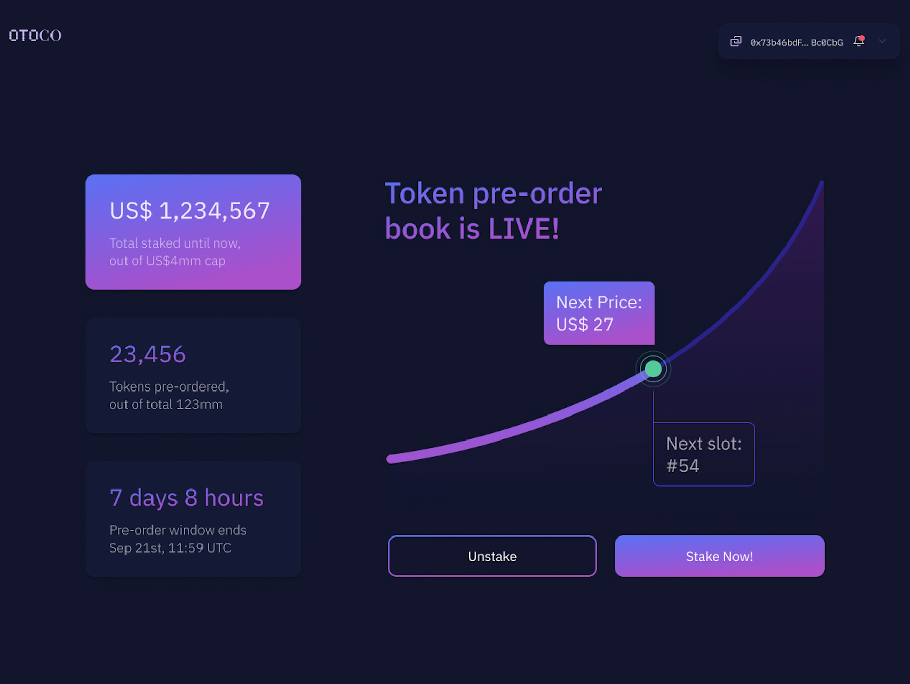

# Part III. A New Smart Contract Solution to Building a Pre-Order Book and Automating Token Issuance

Token issuance models vary, from algorithmic “immaculate conception” distributions to manual and often opaque pre-sales using analog legal documentation.

We spent a fair bit of time thinking how to make our forthcoming token issuance simple, fair, and transparent.

We also wanted to see if there would be an easy way to test community interest without having to worry too much about regulatory restrictions at the pre-sale stage.

In what follows, we explain why we made to the design choices we made, followed by a closer look at our proposed token issuance smart contract. We conclude with more details on our OtoCo token sale process.  
  

